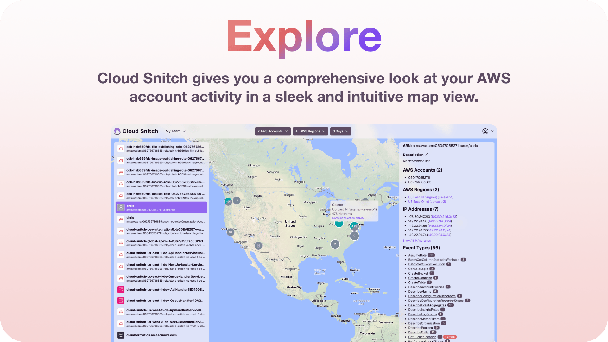
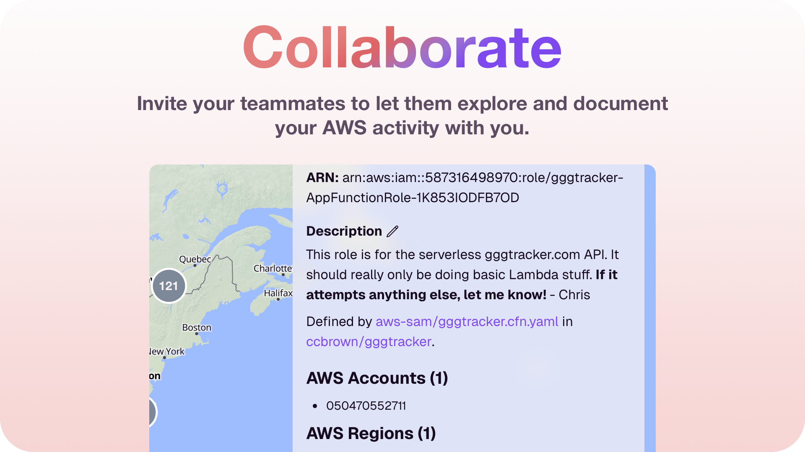
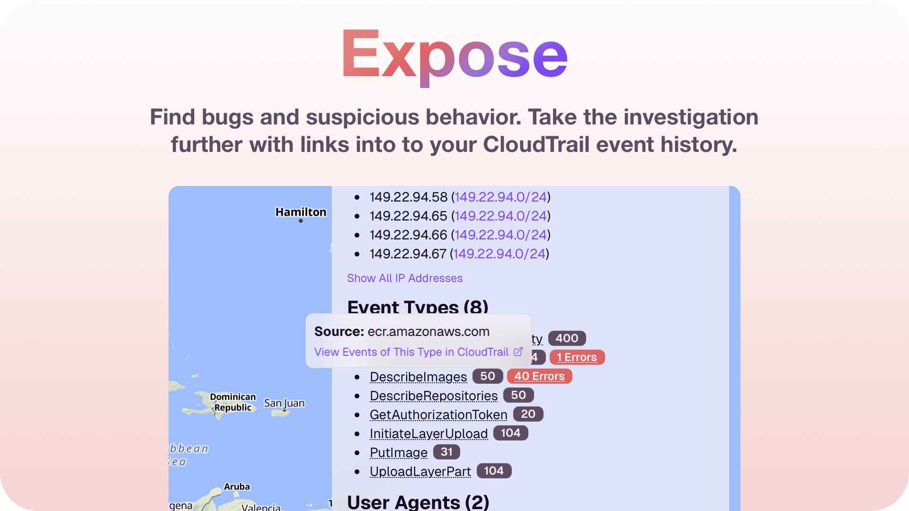

# [Cloud Snitch](https://cloudsnitch.io)

Whether you're a developer, security engineer, or just a curious person, Cloud Snitch is guaranteed to teach you something and take your relationship with your cloud to the next level.

Cloud Snitch provides a sleek and intuitive way of exploring your AWS account activity. It's a great addition to any toolbox, regardless of if you're a hobbyist that's just getting started with the cloud or a large enterprise with complex and mature cloud infrastructure.

## Features

Cloud Snitch gives you a comprehensive look at your AWS account activity in sleek and intuitive map view.

With Cloud Snitch, there's no excuse for not knowing everything your AWS accounts are up to.

Invite your teammates to let them explore your AWS activity with you.

Share links to IP address, CIDR network, and AWS principal activity.

Document AWS principals with Markdown notes for your teammates.

Cloud Snitch provides summaries of activity by AWS region, principal, IP address, and CIDR network.

Errors are highlighted, so you can quickly spot suspicious behavior or bugs in your code.

Take the investigation further with links into to your CloudTrail event history.

## Open Source or SaaS

Cloud Snitch is open sourced under the MIT license ([LICENSE-MIT](LICENSE-MIT) or http://opensource.org/licenses/MIT) so if you're feeling adventurous, you can deploy it directly to your own cloud. Alternatively, you can get up and running in under 5 minutes with an individual or team plan at [cloudsnitch.io](https://cloudsnitch.io).
